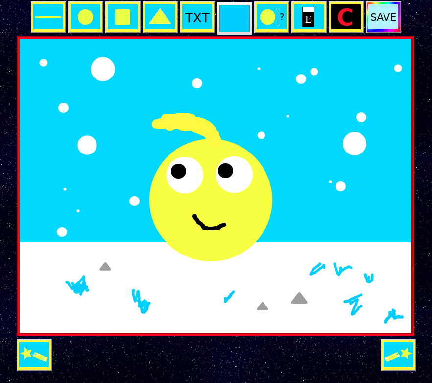
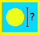
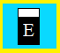
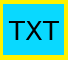
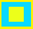
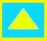
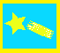
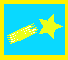

# Web Canvas
#### National Tsing Hua University
#### CS 241002 Software Studio 2018 Spring Assignment 1

</img>

## Components
<h3> Features </h3>
1. <b>Brush</b>
    </img>
    * Color and brush width are adjustable.
    
2. <b>Eraser</b>
    </img>
    * Clear the selected path in canvas
 
3. <b>TXT Input</b>
    </img>
    * User can add txt to the canvas
    * Customized Options: italic，font(Arial, sans-serif, serif, Verdana), font size, font color, insert position
    
4. <b>Mouse cursor</b>
    * Mouse cursor will change to the specific picture corresponding to the tools        selected for easy understanding what tools     user is using right now.

5. <b>Reset canvas</b>  </img>
    * Clear the entire canvas

 <h3>Advanced features</h3>
6. <b>Brush shape</b>
    </img>
    </img>
    </img>
    * User can draw circle, rectangle and triangle by selecting specific brush shape 

7. <b>Un/Re-do</b>
    </img>
    </img>
    * Un-do or Re-do the previous/after draw action

8. <b>Download the current canvas</b>
    </img>
    * User can download the current canvas as a JPG file

## Student ID , Name and Template URL
-  Name : Hao-Ping Lin
-  URL : https://1052005s.gitlab.io/AS_01_WebCanvas
